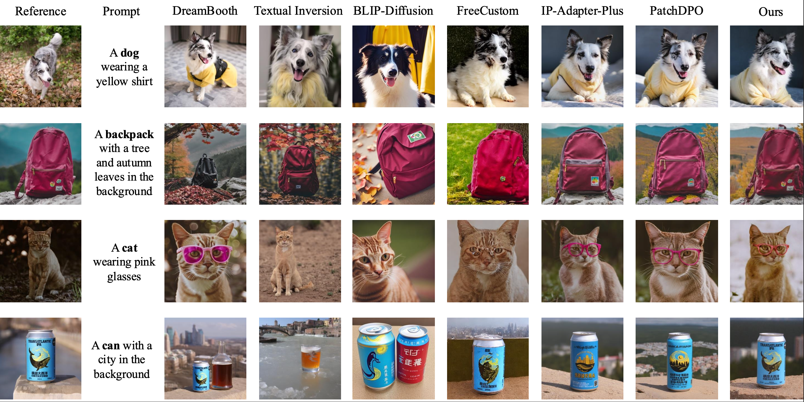
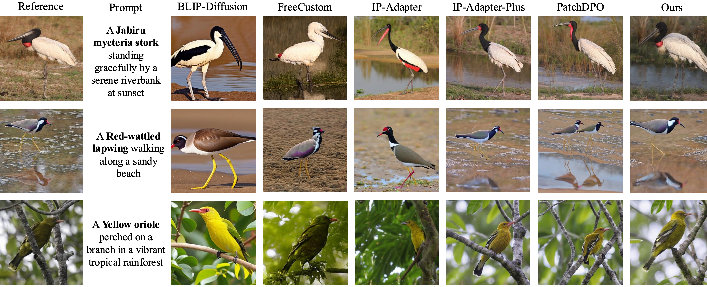

# 🧩 KA-Diff

Official implementation of "KA-Diff: A Training-Free Knowledge-Augmented Diffusion Framework with Correspondence-Aware Feature Injection".

---

## 📖 Abstract

Text-to-image diffusion models have achieved remarkable success in generating high-quality images from diverse natural language prompts; however, their performance deteriorates on knowledge-intensive or long-tail concepts due to inherent limitations in the training data. To overcome this challenge, we propose KA-Diff, a training-free Retrieval-Augmented Generation (RAG) framework that enhances knowledge-intensive text-to-image generation by dynamically integrating external knowledge into diffusion models without requiring additional training or fine-tuning. Specifically, KA-Diff consists of two key components: a dynamic knowledge-enhanced multimodal retriever and a correspondence-aware retrieval-guided generator. The retriever enriches textual queries via web-augmented semantic expansion and leverages MLLM-based re-ranking to identify accurate and contextually relevant visual references, thus facilitating the selection of the most suitable targets. Building upon these references, the generator introduces a correspondence-aware feature injection mechanism to establish dense semantic correspondences between reference and generated images, enabling precise transfer of concept-specific attributes while preserving the intended prompt semantics. Extensive experiments demonstrate that KA-Diff substantially outperforms existing methods in knowledge-intensive text-to-image generation.

---

## 🛠️ Environment Setup

Create the conda environment and navigate to the project directory:

```bash
conda env create -f environment.yml
conda activate diff
cd diff
```

---

## 🔌 Model Downloads

### 1. Download [IP-Adapter](https://huggingface.co/h94/IP-Adapter/tree/main/sdxl_models/image_encoder) models

```bash
mkdir IP-Adapter
cd IP-Adapter
git lfs install
git clone https://huggingface.co/h94/IP-Adapter
mv IP-Adapter/models models
mv IP-Adapter/sdxl_models sdxl_models
```

---

### 2. Download [RealVisXL_V1.0](https://huggingface.co/SG161222/RealVisXL_V1.0) model

```bash
mkdir RealVisXL_V1.0
cd RealVisXL_V1.0
git lfs install
git clone https://huggingface.co/SG161222/RealVisXL_V1.0
mv ./RealVisXL_V1.0/* ./
```

---

### 3. Download [Stable Diffusion XL Base 1.0](https://huggingface.co/stabilityai/stable-diffusion-xl-base-1.0) model

```bash
mkdir stable-diffusion-xl-base-1.0
cd stable-diffusion-xl-base-1.0
git lfs install
git clone https://huggingface.co/stabilityai/stable-diffusion-xl-base-1.0
mv ./stable-diffusion-xl-base-1.0/* ./
```

---

## 🧪 Example Usage

### Using RealVisXL with IP-Adapter-XL-Plus

```bash
python run_ipadapterXLplus_args.py \
  --base_model_path RealVisXL_V1.0/ \
  --image_encoder_path IP-Adapter/models/image_encoder/ \
  --ip_ckpt IP-Adapter/sdxl_models/ip-adapter-plus_sdxl_vit-h.bin \
  --output_dir output/vis_sdxl_plus/ \
  --scale 0.5 \
  --reference_image_path assets/combination_1/cat.jpg \
  --mask_image_path assets/combination_1/cat_mask.png \
  --prompt "a cat is running" \
  --ref_prompt "a cat" \
  --seed 42 \
  --use_ini_latents
```

---

### Using Stable Diffusion XL Base with IP-Adapter

```bash
python run_ipadapter_args.py \
  --base_model_path stable-diffusion-xl-base-1.0/ \
  --image_encoder_path IP-Adapter/sdxl_models/image_encoder/ \
  --ip_ckpt IP-Adapter/sdxl_models/ip-adapter_sdxl.bin \
  --output_dir output/vis_sdxl/ \
  --scale 0.6 \
  --reference_image_path assets/combination_1/cat.jpg \
  --mask_image_path assets/combination_1/cat_mask.png \
  --prompt "a cat is running" \
  --ref_prompt "a cat" \
  --seed 42 \
  --use_ini_latents
```

---

## ⚙️ Argument Explanation

| Argument | Description |
|----------|-------------|
| `--base_model_path` | Path to the base diffusion model checkpoint |
| `--image_encoder_path` | Path to the image encoder weights used by IP-Adapter |
| `--ip_ckpt` | Path to the IP-Adapter model weights |
| `--reference_image_path` | Path to the reference image |
| `--mask_image_path` | Path to the mask image. You can try to use [Grounded-Segment-Anything](https://github.com/IDEA-Research/Grounded-Segment-Anything) or any other segmentation tools to obtain concept masks |
| `--prompt` | Text prompt for image generation |
| `--ref_prompt` | Text description of the reference image |
| `--scale` | Controls the influence of the image prompt (lower = more diversity, higher = more consistent) |
| `--seed` | Random seed |
| `--use_ini_latents` | Whether to copy the initial latent from the reference image based on the mask; if not set, a random latent will be used |

---

## 🎯 Prompting Tips

According to IP-Adapter guidelines:

- **If you're using only image prompts**:
  - Set `scale=1.0`, and use `prompt=""` or generic prompts like `"best quality"`
  - Lower `scale` values produce more diverse results but less consistent with the reference

- **For multi-modal prompts (text + image)**:
  - Adjust `scale` to balance between image and text inputs
  - A good starting point is `scale=0.5` for ip-adapter-plus and `scale=0.6` for ip-adapter

---

## 🎨 Demo





---
## 🌈 Visualizing Feature Correspondence
We provide an additional utility for visualizing feature correspondences between the reference image and the ip-adapter output or ordinary output.

👉 Please refer to [visualize_corresponding/README.md](./visualize_corresponding/README.md) for full usage instructions and examples.

---
## 📊 Baseline Comparisons
We also provide the implementation for obtaining baseline results.

All baseline scripts and configurations are available in the [`get_baseline`](./get_baseline) folder.

And the evaluation code are located in the [`evaluate_code`](./evaluate_code) directory.

---

## 📦 Datasets

We evaluate our method on the DreamBooth dataset as well as our own dataset.

Details of our dataset and retrieval pipeline can be found in the [retrieval](retrieval/) directory.

---

## 🔍 Retrieval

You can use our retrieval module to search for semantically relevant images from the database to augment the generation process.

For detailed instructions, please refer to the [retrieval/README.md](retrieval/README.md).

---
## 🙏 Acknowledgements
We thank to [Stable Diffusion](https://github.com/CompVis/stable-diffusion), [Grounded-Segment-Anything](https://github.com/IDEA-Research/Grounded-Segment-Anything), [HuggingFace](https://huggingface.co/), [dift](https://github.com/Tsingularity/dift), [LLaVA-NeXT](https://github.com/LLaVA-VL/LLaVA-NeXT), [IP-Adapter](https://github.com/tencent-ailab/IP-Adapter)
